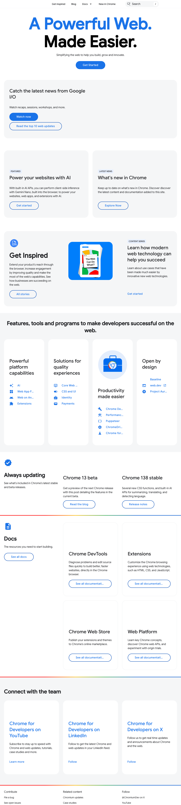

<!-- 

TODO extract as component 
put into page that explain what each color does and with example next to it
load/save from/to local storage
reset on color
reset all

 -->
<template v-for="entry in toConfigure">
<fieldset>
 <legend>{{ entry[0] }}</legend>
 

<ThemeColorPicker v-for="[name, value] in Object.entries(entry[1])"
:css-var="name" :value="value" @change="handleVarChange"/> 
 

</fieldset>

</template>

